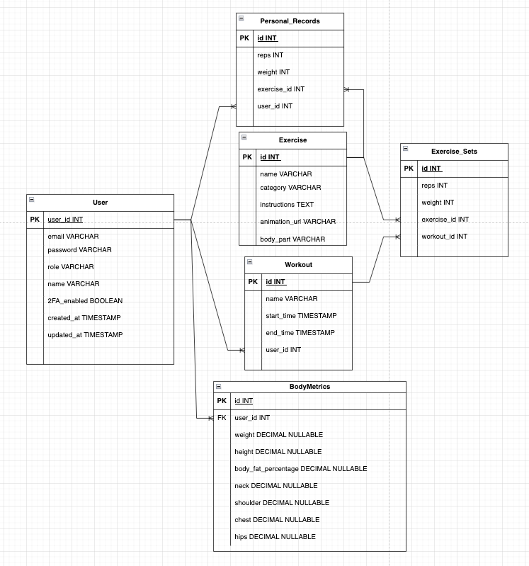

# Workout Tracking App Backend

## 📌 Overview

The **Workout Tracking App** backend is a Java Spring Boot application designed to help users track their workouts, personal records (PRs), and body metrics over time. It provides a RESTful API for managing user workouts, exercises, personal records, and body metrics, enabling progress tracking through charts and graphs.

## 🚀 Features

- **User Authentication & Authorization** (JWT-based security)
- **Workout Management** (CRUD operations on workouts & exercises)
- **Personal Records (PRs) Tracking**
- **Body Metrics Logging & History Tracking**
- **Soft Delete Implementation** (for recoverable data management)
- **Graph & Chart Data Support** (for progress visualization)
- **Global Exception Handling**

## 🛠️ Tech Stack

- **Backend:** Java 21, Spring Boot
- **Database:** PostgreSQL / MySQL
- **Security:** Spring Security, JWT Authentication
- **Build Tool:** Maven
- **Version Control:** Git, GitHub

## 📂 Project Structure

```
workout-tracking-app/
│── src/main/java/com/example/WorkoutTrackingApp
│   ├── auth/              # User authentication & security
│   ├── controller/        # REST API controllers
│   ├── service/           # Business logic
│   ├── repository/        # Data persistence layer
│   ├── entity/            # Database entities
│   ├── dto/               # Data transfer objects
│   ├── utils/             # Utility classes
│── src/main/resources/
│   ├── application.yml    # Configuration files
│── pom.xml                # Maven dependencies
│── README.md              # Project documentation
```

## ⚙️ Setup & Installation

### Prerequisites

- Install **Java 21**
- Install **Maven**
- Set up **PostgreSQL** database

### Steps to Run Locally

1. Clone the repository:
   ```sh
   git clone https://github.com/your-username/workout-tracking-app.git
   cd workout-tracking-app
   ```
2. Configure the database in `application.properties`:
   ```
   spring.datasource.url=jdbc:postgresql://localhost:5432/workout_tracking_app
   spring.datasource.username=postgres
   spring.datasource.password=mysecretpassword
   ```
   
### Database Design

